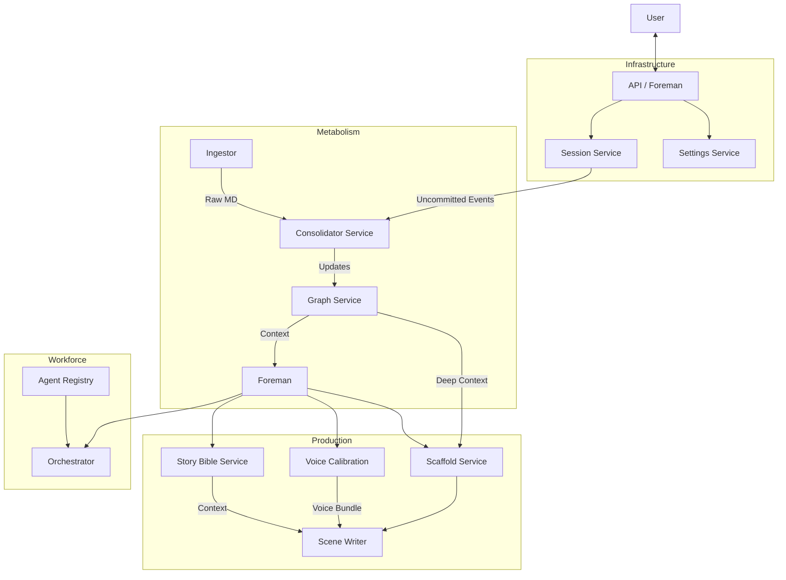

# System Architecture Deep Dive: The Writers Factory City Map

**Date**: November 25, 2025
**Purpose**: To provide a holistic "City Map" of the Writers Factory codebase, explaining not just the linear user journey, but the underlying infrastructure, metabolism, and agent workforce that makes the system alive.

---

## 1. The Foundation (Infrastructure)
*The bedrock upon which the city is built.*

### **Entry Point & API** (`backend/api.py`)
The city gates. This FastAPI application exposes endpoints that the frontend consumes. It initializes the core services and routes requests to the appropriate agents or services.

### **Settings Service** (`backend/services/settings_service.py`)
The city's constitution. It manages configuration using a **3-Tier Resolution System**:
1.  **Project Overrides**: Specific rules for the current project (Highest Priority).
2.  **Global Settings**: User preferences across all projects.
3.  **Defaults**: Hardcoded fallbacks (`DEFAULTS` dataclass).
*   **Key Feature**: Validates values (e.g., scoring weights must sum to 100) and persists them in `sessions.db`.

### **Session Service** (`backend/services/session_service.py`)
The workbench. It manages the **State** of the application.
*   **Role**: Tracks every chat message ("Event") in `sessions.db`.
*   **Mechanism**: Events are marked as `is_committed=False` initially. They only become `True` after the "Metabolism" digests them.
*   **Isolation**: Uses a separate SQLite database from the Knowledge Graph to keep transient state isolated from permanent knowledge.

---

## 2. The Metabolism (Life Support)
*How the city digests information and learns.*

### **The Stomach: Ingestor** (`backend/ingestor.py`)
*   **Function**: Digests raw markdown files (World Bible, Notes).
*   **Engine**: Uses **Local Llama 3.2** (via Ollama) to extract entities and relationships.
*   **Output**: Structured JSON data ready for the graph.

### **The Liver: Consolidator** (`backend/services/consolidator_service.py`)
*   **Function**: The critical bridge between transient chat and permanent knowledge.
*   **Workflow**:
    1.  Reads **uncommitted events** from `SessionService`.
    2.  Reads **unpromoted entries** from `ForemanKB`.
    3.  Uses Llama 3.2 to extract facts.
    4.  **Merges** them into `knowledge_graph.json`, handling conflicts (e.g., "Is the character dead or alive?").
    5.  Marks events as `is_committed=True`.

### **The Brain: Graph Service** (`backend/graph/graph_service.py`)
*   **Function**: The central memory.
*   **Storage**: Hybrid system using **NetworkX** (in-memory analysis) and **SQLAlchemy** (persistence).
*   **Capabilities**: Calculates centrality, finds shortest paths, and manages the ontology of the story world.

---

## 3. The Workforce (Agent Layer)
*The inhabitants who do the work.*

### **The HR Dept: Registry** (`backend/agents/registry.py`)
*   **Function**: Manages the roster of AI agents.
*   **Source**: Loads configuration from `agents.yaml`.
*   **Role**: Tracks API costs, manages API keys, and defines agent capabilities.

### **The Manager: Orchestrator** (`backend/agents/orchestrator.py`)
*   **Function**: Runs the "Tournaments".
*   **Mechanism**:
    1.  **SceneTournament**: Dispatches the same prompt to multiple agents (e.g., Claude, GPT-4) with different strategies (Action, Character, etc.).
    2.  **DraftCritic**: Scores the results based on dimensions like "Voice Authenticity" and "Narrative Impact".

### **The Foreman** (`backend/agents/foreman.py`)
*   **Function**: The user's primary point of contact.
*   **Role**: A state machine that switches modes (Architect, Director, Editor) and delegates tasks to the specialist services.

---

## 4. The Production Line (Creative Pipeline)
*The factories that produce the content.*

### **Phase 1: The Architect** (`story_bible_service.py`)
*   **Output**: The Blueprints (`Protagonist.md`, `Beat_Sheet.md`).
*   **Logic**: Strictly enforces narrative structure (15 beats, fatal flaw) before allowing the project to proceed.

### **Phase 2: Voice Calibration** (`voice_calibration_service.py`)
*   **Output**: The Style Guide (`Voice-Gold-Standard.md`).
*   **Logic**: Runs a tournament to find the perfect voice, then generates a "Bundle" that travels with every future prompt to ensure consistency.

### **Phase 3: The Director** (`scaffold_generator_service.py`)
*   **Output**: The Plan (`Scaffold`).
*   **Logic**:
    1.  **Draft Summary**: Quick preview via Llama 3.
    2.  **Enrichment**: Queries **NotebookLM** for deep context.
    3.  **Full Scaffold**: Combines strategy, voice, and context into a prompt-ready object.

### **Phase 4: The Writer** (`scene_writer_service.py`)
*   **Output**: The Product (`SceneVariant`).
*   **Logic**:
    1.  **Structure**: Generates 5 layout options.
    2.  **Drafting**: Writes the scene using the chosen layout and Voice Bundle.
    3.  **Scoring**: Auto-grades the result.
    4.  **Hybridization**: Merges the best parts of multiple drafts.

---

## System Data Flow Diagram

