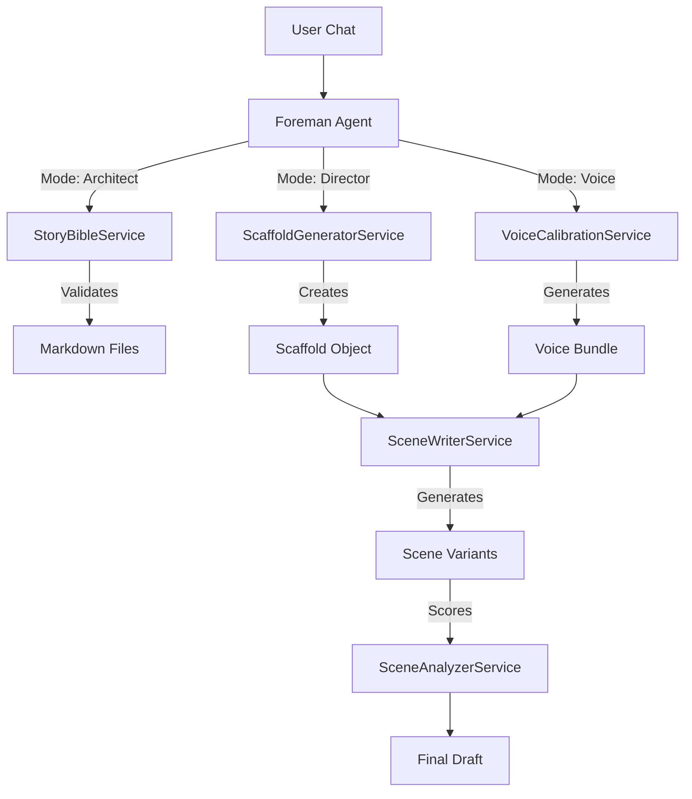

# Codebase Deep Dive: The Writer's Journey

**Date**: November 25, 2025
**Purpose**: To trace the "Writer's Journey" through the actual codebase, ignoring outdated documentation.

---

## 1. The Entry Point: API & Foreman
Everything starts in `backend/api.py` and `backend/agents/foreman.py`. The **Foreman** is the state machine that drives the user through the stages.

*   **Code Location**: `backend/agents/foreman.py`
*   **Key Mechanism**: `ForemanMode` Enum (ARCHITECT -> VOICE_CALIBRATION -> DIRECTOR -> EDITOR).
*   **Data Flow**: User Chat -> `Foreman.chat()` -> `_classify_task_complexity` -> `_query_llm` -> `_parse_and_execute_actions`.

---

## 2. Stage 1: The Architect (Story Bible)
**Goal**: Create the foundational files (`Protagonist.md`, `Beat_Sheet.md`).

*   **Trigger**: `ForemanMode.ARCHITECT`
*   **Service**: `backend/services/story_bible_service.py`
*   **The Pipeline**:
    1.  **Initialization**: `ensure_directory_structure()` creates folders like `Story Bible/Structure`.
    2.  **Parsing**: `ProtagonistParser` and `BeatSheetParser` read markdown files using Regex to extract structured data (e.g., `Fatal Flaw`, `Beat 1`).
    3.  **Validation**: `StoryBibleStatus` checks if `phase2_complete` is True (requires 15 beats, defined flaw/lie).
*   **Output**: Validated `.md` files in the `content/Story Bible` directory.

---

## 3. Stage 2: Voice Calibration (The Tournament)
**Goal**: Define *how* the story sounds before writing it.

*   **Trigger**: `ForemanMode.VOICE_CALIBRATION`
*   **Service**: `backend/services/voice_calibration_service.py`
*   **The Pipeline**:
    1.  **Start**: `start_tournament()` creates a `TournamentResult` object.
    2.  **Generation**: `_run_tournament()` calls `_generate_variant()` for each agent (Claude, GPT-4, etc.) x 5 strategies (Action, Character, etc.).
    3.  **Selection**: `select_winner()` takes the user's choice.
    4.  **Bundle Generation**: `generate_voice_bundle()` creates the critical reference files:
        *   `Voice-Gold-Standard.md` (The target)
        *   `Voice-Anti-Pattern-Sheet.md` (What to avoid)
*   **Output**: A "Voice Bundle" that is injected into every future scene prompt.

---

## 4. Stage 3: The Director (Scaffolding)
**Goal**: Plan the scene strategically before writing prose.

*   **Trigger**: `ForemanMode.DIRECTOR`
*   **Service**: `backend/services/scaffold_generator_service.py`
*   **The Pipeline**:
    1.  **Draft Summary**: `generate_draft_summary()` uses Ollama (Llama 3) to give a quick preview.
    2.  **Enrichment (Optional)**: `fetch_enrichment()` queries **NotebookLM** to pull details about world/characters.
    3.  **Full Scaffold**: `generate_full_scaffold()` compiles everything into a `Scaffold` object containing:
        *   `Strategic Context` (Conflict, Goals)
        *   `Voice Requirements` (from Bundle)
        *   `Continuity Checklist` (Callbacks/Foreshadowing)
*   **Output**: A `Scaffold` object passed to the writer.

---

## 5. Stage 4: The Writer (Scene Generation)
**Goal**: Generate high-quality prose variants.

*   **Trigger**: `Foreman` calls `write_scene` action.
*   **Service**: `backend/services/scene_writer_service.py`
*   **The Pipeline**:
    1.  **Structure Variants**: `generate_structure_variants()` creates 5 layout options (e.g., "Action-Heavy" vs "Internal Monologue").
    2.  **Scene Variants**: `generate_scene_variants()` takes the selected structure + Voice Bundle + Scaffold and generates prose.
        *   *Crucial Step*: It injects the `Voice-Gold-Standard.md` content into the system prompt.
    3.  **Scoring**: `_score_variants()` calls `SceneAnalyzerService` to grade each variant (0-100).
    4.  **Hybridization**: `create_hybrid()` allows merging the best parts of multiple variants.
*   **Output**: A `SceneVariant` (text) that becomes the draft.

---

## Summary of the Code Flow

